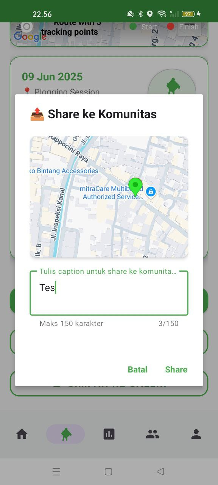

# GleanGo: Make Your World Clean 🌱

[](https://android.com)
[](https://android-arsenal.com/api?level=26)
[](https://www.java.com)
[](LICENSE)

> **GleanGO** - Aplikasi Android inovatif untuk aktivitas plogging yang menggabungkan olahraga dengan kepedulian lingkungan melalui teknologi AI dan GPS presisi tinggi.

**GleanGo** adalah aplikasi Android native yang dirancang untuk mendukung aktivitas plogging (jogging sambil memungut sampah) dengan fitur tracking GPS ultra-presisi, klasifikasi sampah berbasis AI, analitik komprehensif, dan sistem gamifikasi yang menarik. Aplikasi ini sepenuhnya offline-first dengan data tersimpan aman di SQLite lokal.

---

## 📋 Table of Contents

- [About The Project](#-about-the-project)
- [About Fragment & Philosophy](#-about-fragment--philosophy)
- [Features](#-features)
- [Screenshots](#-screenshots)
- [Technical Implementation](#-technical-implementation)
- [Getting Started](#-getting-started)
  - [Prerequisites](#prerequisites)
  - [Installation](#installation)
  - [Configuration](#configuration)
- [Usage Guide](#-usage-guide)
- [Tech Stack](#-tech-stack)

---

## 🎯 About The Project

**GleanGo** adalah solusi digital inovatif untuk mendukung gerakan lingkungan melalui aktivitas plogging. Aplikasi ini menggabungkan teknologi GPS presisi tinggi, machine learning, dan gamifikasi untuk memberikan pengalaman yang menarik dalam menjaga kebersihan lingkungan.

### Problem Statement
- Kurangnya motivasi masyarakat untuk peduli lingkungan
- Kesulitan tracking aktivitas pembersihan lingkungan
- Minimnya data tentang jenis dan lokasi sampah
- Butuh platform yang mudah dan menarik untuk eco-friendly activities

### Solution
GleanGo menyediakan platform terintegrasi yang memadukan:
- **Fitness Tracking**: GPS ultra-presisi untuk tracking rute plogging
- **AI Classification**: Identifikasi otomatis jenis sampah dengan Gemini AI
- **Data Analytics**: Visualisasi statistik personal dan environmental impact
- **Gamifikasi**: Sistem reward dan achievement untuk motivasi berkelanjutan

---

## 🧩 About Fragment & Philosophy

### Logo dan Nama Aplikasi
 <!-- Ganti dengan nama file logo lingkaran -->

### Tentang GleanGo
GleanGo adalah aplikasi plogging yang mengajak pengguna berolahraga sambil menjaga lingkungan dengan memungut sampah.

### Versi Aplikasi
Versi 1.0

### Cerita di Balik Nama & Inspirasi

Nama **GleanGo** terinspirasi dari dua sumber utama:
- Kata "glean" (memungut sisa), selaras dengan aktivitas plogging yang gerakannya sering membungkuk memungut sampah.
- Kata "Go" juga terinspirasi dari game populer Pokémon Go, yang mengajak pemain berjalan dan mencari sesuatu di luar ruangan; GleanGo mengadopsi semangat aktif dan eksplorasi ini dalam aktivitas plogging.

Filosofi ini juga terinspirasi dari lukisan terkenal “The Gleaners” karya Jean-François Millet, yang menggambarkan orang-orang memungut sisa panen di ladang sebagai simbol kerja keras dan kepedulian lingkungan.  
  
[Lihat di Wikipedia](https://en.wikipedia.org/wiki/The_Gleaners)

---

### Apa itu Plogging?

Plogging adalah gabungan aktivitas jogging dan memungut sampah. Nama ini berasal dari kata Swedia “plocka upp” (memungut) dan “jogga” (berlari). Plogging menjadi olahraga yang juga bermanfaat bagi lingkungan dan kesehatan karena membakar lebih banyak kalori dibanding jogging biasa.

### Apa itu Sustainable Development Goals?

Sustainable Development Goals (SDGs) adalah 17 tujuan global yang menjadi “blueprint” untuk masa depan yang lebih baik dan berkelanjutan. GleanGo mendukung beberapa tujuan SDGs, khususnya kesehatan, lingkungan, dan konsumsi bertanggung jawab.

### Tujuan Kami

Kami memilih beberapa SDGs dan mengembangkan GleanGo sebagai aplikasi plogging yang mendorong aktivitas sehat sekaligus ramah lingkungan.

### Good Health and Well-Being

Melalui plogging, pengguna bisa meningkatkan kesehatan sekaligus berbagi pencapaian dengan komunitas.

### Responsible Consumption and Production

Dengan memungut dan mendaur ulang sampah saat berolahraga, pengguna berkontribusi pada konsumsi dan produksi yang bertanggung jawab.

---

## ✨ Features

### 🏃‍♂️ Plogging Tracking
- **GPS Precision Tracking**: Real-time route tracking dengan akurasi tinggi
- **Live Statistics**: Monitor jarak, waktu, kecepatan secara real-time
- **Offline Mode**: Tetap dapat tracking meski tanpa koneksi internet
- **Route Visualization**: Visualisasi rute di Google Maps

### 🤖 AI-Powered Waste Classification
- **Smart Camera**: Identifikasi jenis sampah menggunakan Gemini AI
- **Instant Recognition**: Klasifikasi otomatis berbagai jenis sampah
- **Photo Documentation**: Simpan foto sampah dengan metadata lokasi
- **Waste Database**: Database komprehensif jenis sampah yang ditemukan

### 📊 Analytics & Statistics
- **Personal Dashboard**: Statistik pribadi lengkap
- **Environmental Impact**: Perhitungan dampak lingkungan
- **Charts & Graphs**: Visualisasi data menggunakan MPAndroidChart
- **Progress Tracking**: Monitor perkembangan aktivitas plogging

### 🎮 Gamification System
- **Points & Rewards**: Sistem poin untuk setiap aktivitas
- **Badges & Achievements**: Unlock badge berdasarkan pencapaian
- **Profile Customization**: Personalisasi avatar dan background
- **Shopping System**: Tukar poin dengan reward virtual

### 🌐 Community Features
- **Social Feed**: Berbagi aktivitas plogging dengan komunitas
- **Leaderboard**: Kompetisi sehat antar pengguna
- **News & Events**: Informasi terkini seputar lingkungan
- **Post & Comments**: Interaksi sosial dengan sesama pecinta lingkungan

### 🗺️ Mapping & Location
- **Trash Map**: Peta lokasi sampah yang ditemukan komunitas
- **Route History**: Riwayat rute plogging yang pernah dilakukan
- **Location Sharing**: Bagikan lokasi sampah ke komunitas
- **Hotspot Detection**: Identifikasi area dengan sampah terbanyak

---

## 📱 Screenshots

### Registration Screen
Tampilan untuk mendaftarkan akun baru.


### Login Screen
Tampilan untuk login ke akun yang sudah terdaftar.


### Dashboard & Home Screen
Tampilan utama aplikasi dengan statistik cepat dan akses mudah ke fitur utama.


### Plogging Activity Tracking
Interface untuk tracking aktivitas plogging dengan GPS real-time dan kontrol session.


### AI Waste Recognition
Fitur pengenalan sampah otomatis menggunakan kamera dan AI classification.


### Activity Summary
Ringkasan detail setelah menyelesaikan aktivitas plogging.


### Social Sharing
Fitur berbagi aktivitas ke komunitas dengan opsi kustomisasi post.


### Community Hub
Platform sosial untuk berinteraksi dengan sesama pecinta lingkungan.


### Leaderboard & Rankings
Sistem peringkat berdasarkan aktivitas dan kontribusi pengguna.


### Environmental News
Berita terkini seputar lingkungan dan keberlanjutan.


### Statistics & Analytics
Dashboard analytics dengan visualisasi data komprehensif.


### User Profile
Profil pengguna dengan sistem badge dan achievement.


### Badge Customization
Pengaturan badge dan dekorasi profil.


### Points Shop
Sistem marketplace untuk menukar poin dengan reward.


---

## 🔧 Technical Implementation

### Architecture Pattern
- **MVVM (Model-View-ViewModel)**: Clean architecture untuk maintainability
- **Repository Pattern**: Centralized data management
- **Observer Pattern**: Real-time data updates menggunakan LiveData

### Core Technologies
- **Language**: Java (100%)
- **Minimum SDK**: API 26 (Android 8.0)
- **Target SDK**: API 34 (Android 14)
- **Build System**: Gradle with Version Catalog

### Security Features
- **Permission Management**: Dynamic permission handling
- **Data Encryption**: Local SQLite database dengan encryption
- **Privacy Protection**: User data protection compliance
- **Secure API Calls**: Encrypted communication dengan external APIs

---

## 🚀 Getting Started

### Prerequisites

Pastikan sistem development Anda memiliki:
- **Android Studio**: Arctic Fox (2020.3.1) atau lebih baru
- **JDK**: Java 11 atau lebih baru
- **Android SDK**: API Level 26-34
- **Google Play Services**: Untuk Maps dan Location
- **Gradle**: 7.4 atau lebih baru

### Installation

1. **Clone Repository**
```bash
git clone https://github.com/username/glean.git
cd glean
```

2. **Buka di Android Studio**
```bash
# Buka Android Studio dan pilih "Open an existing project"
# Navigate ke folder glean yang sudah di-clone
```

3. **Sync Dependencies**
```bash
# Android Studio akan otomatis sync Gradle dependencies
# Tunggu hingga proses sync selesai
```

### Configuration

1. **Setup API Keys**
Buat file `local.properties` di root project dan tambahkan:
```properties
MAPS_API_KEY=your_google_maps_api_key_here
GEMINI_API_KEY=your_gemini_ai_api_key_here
NEWS_API_KEY=your_news_api_key_here
```

2. **Google Maps Setup**
- Enable Google Maps Android API di Google Cloud Console
- Enable Places API untuk location services
- Enable Geocoding API untuk address conversion

3. **Gemini AI Setup**
- Dapatkan API key dari Google AI Studio
- Enable Generative AI API

4. **Permissions Setup**
Aplikasi memerlukan permissions berikut:
- Location (Fine & Coarse)
- Camera access
- Storage access
- Internet connection

---

## 📖 Usage Guide

### 1. Onboarding & Registration
- **First Launch**: Splash screen dengan brand introduction
- **Authentication**: Register dengan email atau login existing account
- **Profile Setup**: Lengkapi profil dan preferences

### 2. Starting a Plogging Session
```java
// Langkah-langkah memulai plogging:
1. Tap "Mulai Plogging" di home screen
2. Grant location permissions jika diminta
3. Pilih mode tracking (Outdoor/Indoor)
4. Tap "Start" untuk memulai session
5. Aplikasi akan mulai track GPS dan timer
```

### 3. During Plogging Session
- **Real-time Tracking**: Monitor jarak, waktu, dan kecepatan
- **Add Trash**: Gunakan kamera untuk scan dan classify sampah
- **Map View**: Lihat rute yang sudah dilalui
- **Pause/Resume**: Control session sesuai kebutuhan

### 4. AI Waste Classification
```java
// Menggunakan fitur AI classification:
1. Dalam session plogging, tap ikon kamera
2. Arahkan kamera ke sampah yang ditemukan
3. Tap capture untuk mengambil foto
4. AI akan otomatis classify jenis sampah
5. Konfirmasi atau edit hasil classification
6. Save ke database dengan GPS coordinate
```

### 5. Post-Session Activities
- **Summary Review**: Lihat ringkasan aktivitas
- **Share to Community**: Bagikan achievement ke social feed
- **Points Calculation**: Otomatis dapat poin berdasarkan aktivitas
- **Route Saving**: Simpan rute untuk referensi future

### 6. Community Interaction
- **Browse Feed**: Lihat aktivitas pengguna lain
- **Like & Comment**: Interaksi dengan post komunitas
- **Follow Users**: Follow pengguna inspiratif
- **Share Stories**: Bagikan pengalaman plogging

### 7. Analytics & Progress Tracking
- **Personal Stats**: Monitor progress harian/bulanan
- **Environmental Impact**: Lihat kontribusi terhadap lingkungan
- **Goal Setting**: Set dan track personal goals
- **Achievement Unlocks**: Unlock badge berdasarkan milestone

---

## 🛠️ Tech Stack

### Frontend
- **Language**: Java
- **UI Framework**: Android Views dengan Material Design
- **Navigation**: Navigation Component
- **View Binding**: Type-safe view references
- **Layouts**: ConstraintLayout, RecyclerView, ViewPager2

### Backend & Database
- **Local Database**: Room (SQLite wrapper)
- **Data Persistence**: SharedPreferences untuk settings
- **File Storage**: Internal storage untuk photos
- **Caching**: Glide untuk image caching

### External Services
- **Maps**: Google Maps Android API
- **Location**: Google Location Services (FusedLocationProviderClient)
- **AI**: Google Gemini AI untuk image classification
- **News**: NewsAPI untuk environmental news

### Development Tools
- **IDE**: Android Studio
- **Build System**: Gradle dengan Version Catalog
- **Version Control**: Git
- **Testing**: JUnit, Espresso
- **Code Analysis**: Android Lint

---

<div align="center">

**Made with 💚 for a cleaner world**

*GleanGo - Making environmental action fun, social, and impactful*

</div>