<p align="center">
  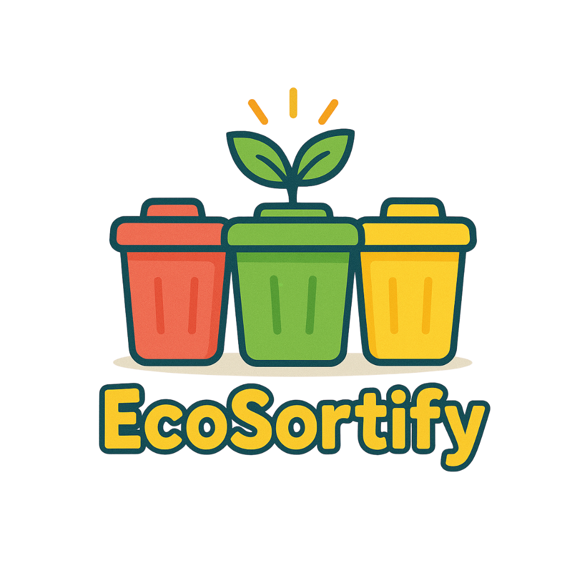
</p>
<h1 align="center">GleanGo: Make Your World Clean 🌱</h1>
<p align="center">
  <b>Plogging app for a cleaner world — Run, pick up, and make a difference with AI and GPS.</b>
</p>
<p align="center">
  <a href="https://android.com"></a>
  <a href="https://android-arsenal.com/api?level=26"></a>
  <a href="https://www.java.com"></a>
  <a href="LICENSE"></a>
</p>


## 🌱 Apa itu Plogging?

<p align="center">
  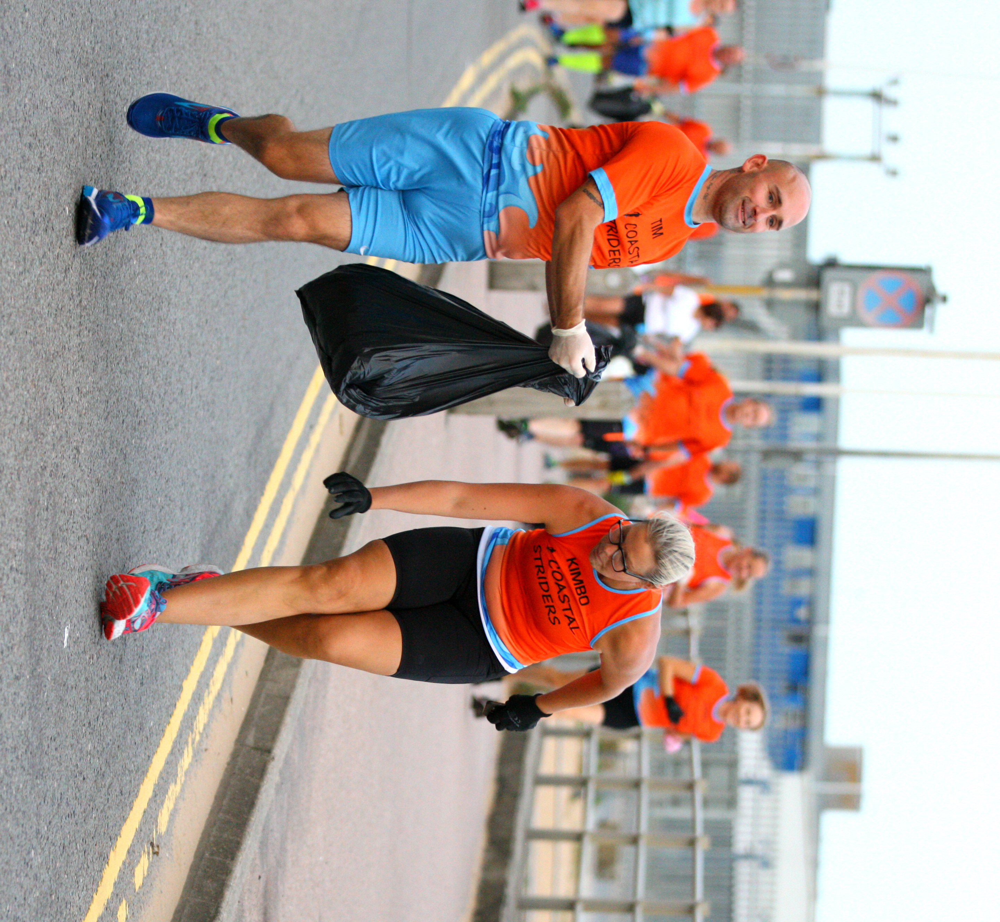
</p>

**Just jogging and just pick up the trash!**  
Plogging adalah gabungan aktivitas jogging dan memungut sampah. Nama ini berasal dari kata Swedia “plocka upp” (memungut) dan “jogga” (berlari). Plogging bukan sekadar olahraga, ini adalah aksi kecil untuk perubahan besar, membakar lebih banyak kalori dan membantu lingkungan tetap bersih!

---


## 🌏 Filosofi

**GleanGo lahir dari keinginan sederhana: membuat olahraga dan aksi nyata menjaga lingkungan jadi lebih seru dan bermakna.**
  
Bayangkan kamu jogging pagi, tapi kali ini setiap langkahmu tak hanya menyehatkan, tapi juga membersihkan jalanan dari sampah. 

Perubahan besar dimulai dari aksi kecil yang konsisten.  
Dengan teknologi GPS presisi tinggi, AI untuk klasifikasi sampah, dan sistem gamifikasi yang seru, GleanGo ingin mengajakmu menjadi bagian dari gerakan hijau masa kini.

Nama “GleanGo” sendiri mengandung filosofi mendalam:
- “Glean” berarti memungut sisa, terinspirasi dari lukisan "The Gleaners" karya Jean-François Millet, yang menggambarkan orang-orang sederhana memungut sisa panen sebagai simbol kerja keras dan kepedulian lingkungan.
- “Go” diambil dari semangat game Pokémon Go — mengajakmu aktif bergerak, mencari, dan mengeksplorasi lingkungan sekitar.
  <div align="center">
    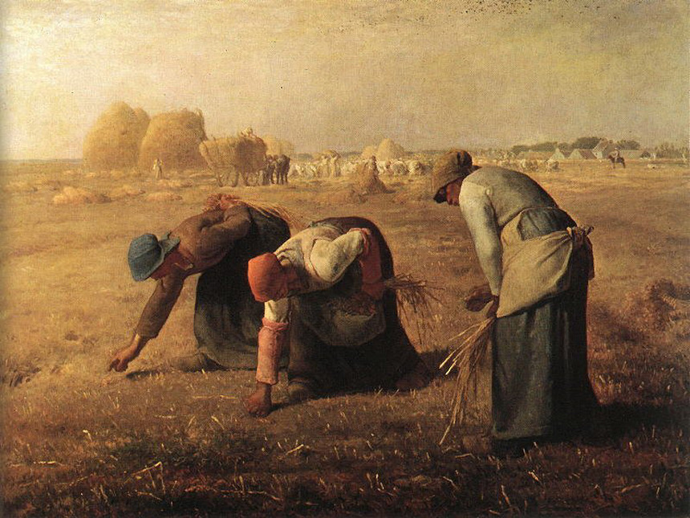<br>
    <a href="https://en.wikipedia.org/wiki/The_Gleaners">[Baca kisah lukisan ini di Wikipedia]</a>
  </div>

Setiap fitur di GleanGo dirancang untuk membuat kontribusimu terasa nyata. Mulai dari tracking rute, pengenalan sampah otomatis, hingga komunitas yang saling mendukung.

> **Dengan GleanGo, setiap langkahmu berarti untuk kesehatan dan bumi yang lebih bersih.**

---

## 🌐 Sustainable Development Goals (SDGs)

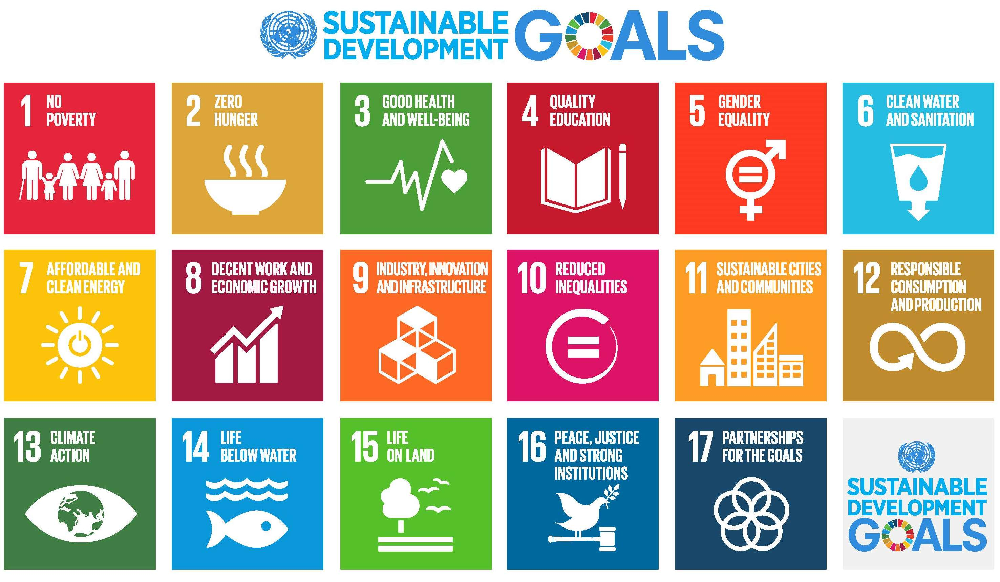

Sustainable Development Goals (SDGs) adalah 17 tujuan global sebagai “blueprint” masa depan yang lebih baik dan berkelanjutan.  
GleanGo mendukung beberapa SDGs, khususnya:
- **Good Health and Well-Being**: Melalui plogging, kamu sehat dan lingkungan juga bersih!
- **Responsible Consumption and Production**: Dengan memilah dan mendaur ulang sampah yang ditemukan.

---

## 🎯 Tujuan

- Menjadikan plogging gaya hidup baru di Indonesia.
- Menciptakan komunitas peduli lingkungan yang saling mendukung.
- Mengubah aksi pribadi jadi dampak kolektif melalui teknologi.

---

## 🏆 Fitur Utama

- **Tracking Plogging Real-Time:** GPS ultra-presisi, rute jelas, statistik lengkap!
- **AI Waste Classification:** Foto dan AI akan bantu identifikasi jenis sampah yang kamu pungut.
- **Gamification & Reward:** Dapatkan poin, badge, dan tukar reward menarik!
- **Komunitas Sosial:** Share, like, dan komentar aktivitas plogging temanmu.
- **News & Education:** Update berita lingkungan dan tips hidup hijau.

---

## 🙌 Cara Penggunaan

### 1. Login & Registrasi
<p align="center">
  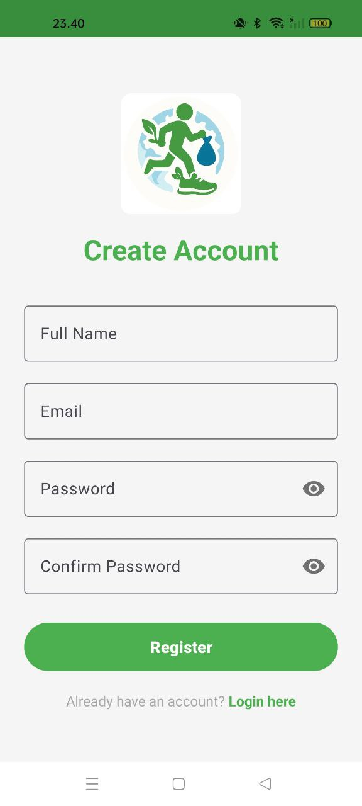
  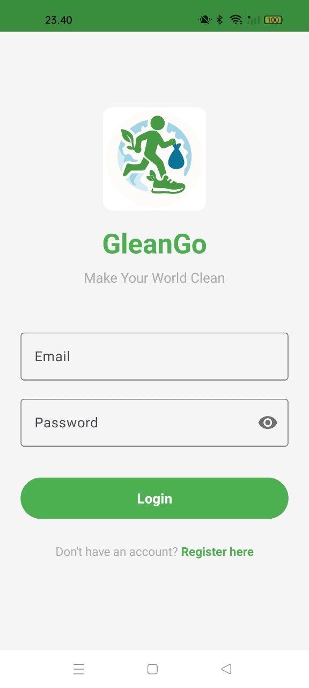
</p>

- Daftar akun baru atau login menggunakan akun yang sudah ada.
- Lengkapi profil sesuai preferensi.

---

### 2. Dashboard & Mulai Plogging
<p align="center">
  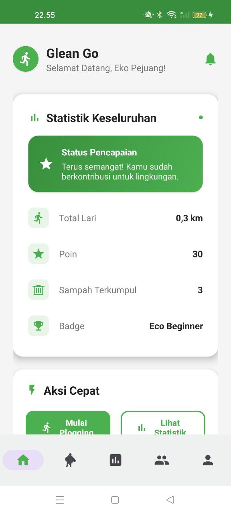
</p>

- Setelah login, kamu akan masuk ke halaman beranda yang menampilkan statistik dan akses fitur utama.
- Tekan “Mulai Plogging” untuk memulai sesi plogging.

---
### 3. Tracking Plogging & Scan Sampah
<p align="center">
  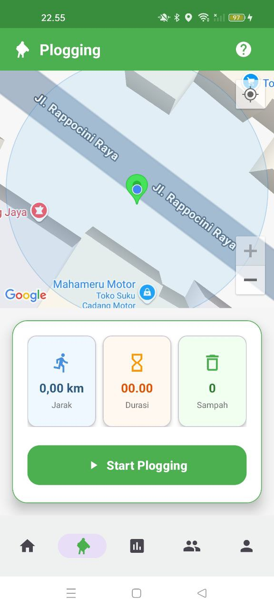
  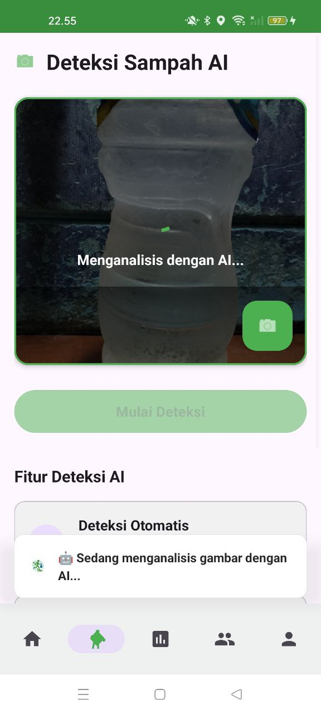
  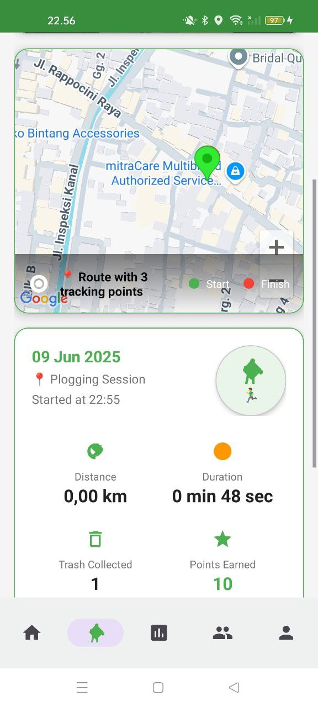
</p>

- Saat sesi berjalan, rute, jarak, dan waktu akan tercatat otomatis.
- Temukan sampah? Tap ikon kamera untuk scan & klasifikasi menggunakan AI.
- Setelah selesai, lihat ringkasan aktivitas: statistik, sampah terkumpul, poin, dan badge.

---

### 4. Komunitas & Statistik
<p align="center">
  
  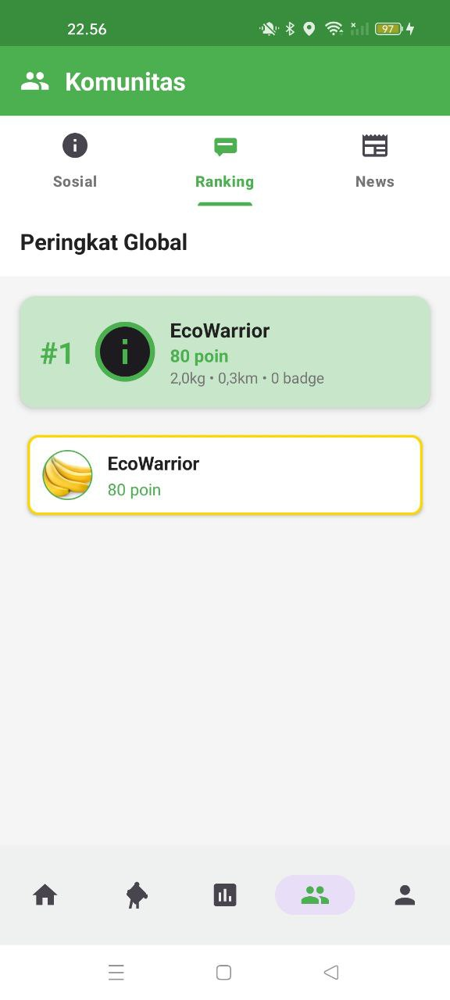
  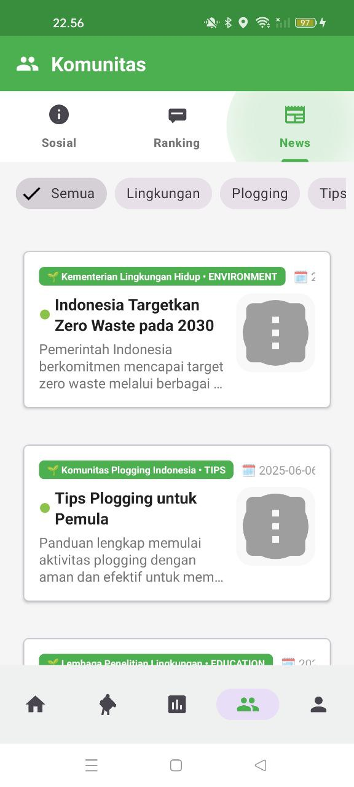
  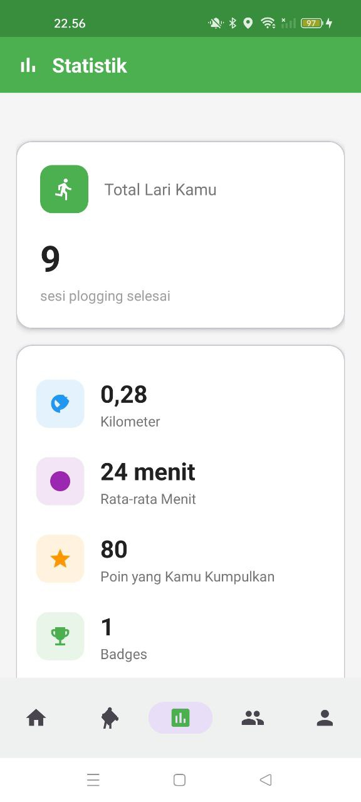
</p>

- Bagikan aktivitas ke komunitas dan lihat aktivitas pengguna lain.
- Kompetisi sehat lewat leaderboard.
- Baca update berita lingkungan.
- Lihat statistik perkembangan plogging.

---

### 5. Profil & Fitur Lain
<p align="center">
  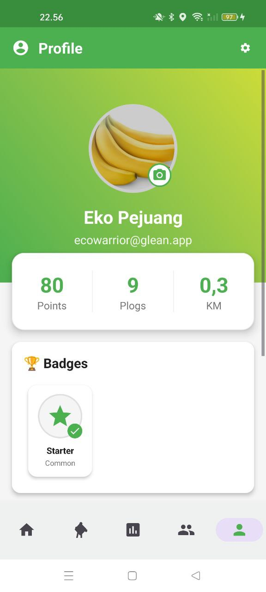
  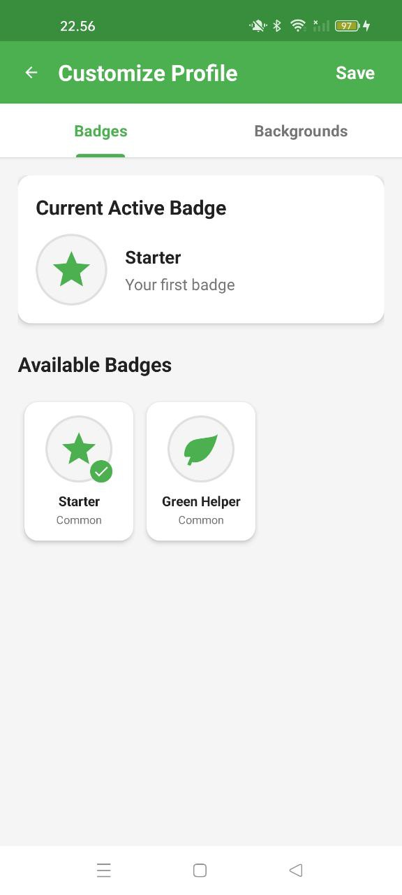
  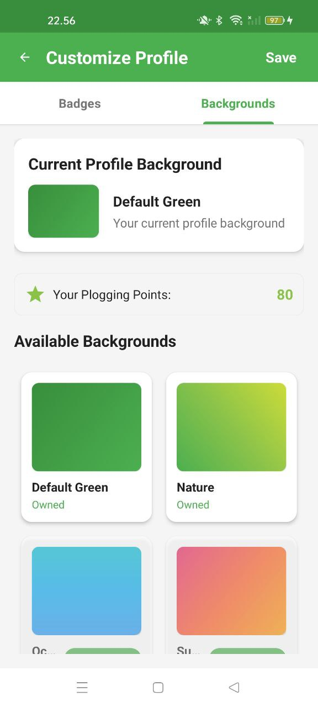
</p>

- Personalisasi profil dan koleksi badge.
- Tukar poin dengan reward virtual di menu.

---

## 🛠️ Tech Stack

- **Platform:** Android native (Java)
- **UI:** Material Design, View Binding, ConstraintLayout
- **Database:** Room (SQLite)
- **Maps & Location:** Google Maps & Location Services
- **AI:** Google Gemini AI  
- **News:** NewsAPI

---

## 🚀 Getting Started

1. **Clone repo:**  
   ```bash
   git clone https://github.com/username/glean.git
   cd glean
   ```
2. **Buka di Android Studio**  
3. **Sync dependencies**  
4. **Konfigurasi API Keys** di `local.properties`:  
   ```
   MAPS_API_KEY=your_google_maps_api_key_here
   GEMINI_API_KEY=your_gemini_ai_api_key_here
   NEWS_API_KEY=your_news_api_key_here
   ```
5. **Run di emulator/device**

---

<div align="center">

**Made with 💚 for a cleaner world**  
*GleanGo - Making environmental action fun, social, and impactful*

</div>