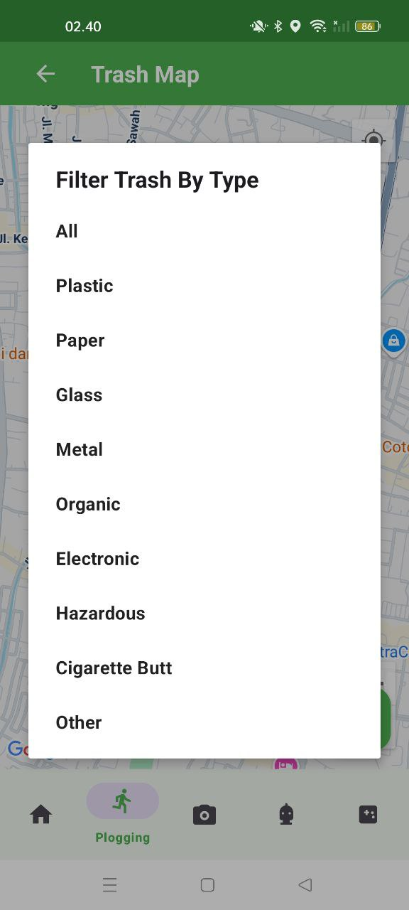

<p align="center">
  
</p>
<h1 align="center">EcoSortify: Pilah Sampah, Selamatkan Bumi 🌱</h1>
<p align="center">
  <b>Aplikasi edukasi dan panduan pemilahan sampah — Mudah, interaktif, dan ramah lingkungan.</b>
</p>
<p align="center">
  <a href="https://android.com"></a>
  <a href="https://android-arsenal.com/api?level=21"></a>
  <a href="https://www.java.com"></a>
  <a href="LICENSE"></a>
</p>

---

## 🗑️ Latar Belakang & Permasalahan

<p align="center">
  
</p>

Pengelolaan sampah di Indonesia masih menjadi tantangan besar. Sampah yang tidak dipilah dengan baik mencemari lingkungan dan menyulitkan proses daur ulang. Data tahun 2023 menunjukkan 57% rumah tangga di Indonesia masih membakar sampah. Kurangnya kesadaran dan pengetahuan masyarakat menjadi penyebab utama, di mana hampir separuh masyarakat tidak pernah memilah sampah organik dan anorganik (Kompas, 2021).

### Tantangan
- Minimnya pengetahuan tentang pentingnya memilah sampah
- Keterbatasan sumber daya untuk edukasi
- Sulitnya memantau efektivitas program pemilahan sampah

---

## 💡 Solusi: EcoSortify

EcoSortify hadir sebagai aplikasi edukasi lingkungan yang praktis dan mudah diakses. Aplikasi ini bertujuan meningkatkan kesadaran masyarakat tentang pemilahan sampah melalui platform edukasi visual, tips praktis, dan panduan interaktif.

### Tujuan Aplikasi
- Mempermudah pengguna mengenali jenis sampah melalui foto dan ilustrasi
- Meningkatkan kesadaran memilah sampah dengan benar
- Mendukung pengelolaan lingkungan yang lebih bersih dan berkelanjutan

### Target Pengguna
Seluruh masyarakat umum, pelajar, dan aktivis lingkungan.

---

## ♻️ Apa itu EcoSortify?

EcoSortify adalah aplikasi Android yang membantu masyarakat mengenal, memilah, dan mengelola sampah dengan cara yang mudah dan menyenangkan. Dengan edukasi visual, tips praktis, dan panduan interaktif, EcoSortify mendorong perubahan kecil yang berdampak besar untuk lingkungan.

<p align="center">
  
</p>

**Pilah sampah, mulai dari rumah!**

---

## 🌐 Sustainable Development Goals (SDGs)

<p align="center">
  
</p>

EcoSortify mendukung SDGs, khususnya:
- **Quality Education (SDG 4)**: Edukasi lingkungan yang mudah diakses untuk semua kalangan.
- **Sustainable Cities and Communities (SDG 11)**: Mendorong kebiasaan memilah sampah demi kota yang lebih bersih dan berkelanjutan.
- **Climate Action (SDG 13)**: Mengurangi polusi dan dampak lingkungan melalui pengelolaan sampah yang lebih baik.

---

## 🎯 Tujuan

- Meningkatkan kesadaran pentingnya pemilahan sampah.
- Memberikan edukasi dan panduan praktis pengelolaan sampah.
- Mendukung gaya hidup ramah lingkungan di masyarakat.

---

## 🏆 Fitur Utama

- **Klasifikasi Sampah:** Mengenali dan membedakan sampah organik, anorganik, dan B3 secara visual dan interaktif.
- **EcoBot:** Asisten virtual yang memberikan panduan langkah demi langkah dalam memilah sampah dengan benar.
- **Game Edukatif:** Permainan seru untuk mengasah pengetahuan dan meningkatkan kesadaran tentang pengelolaan sampah.
- **Plogging:** Fitur untuk mendukung aktivitas plogging (jogging sambil memungut sampah) dan mencatat kontribusi pengguna terhadap lingkungan.

---

## 🙌 Cara Penggunaan

### 1. Beranda
<p align="center">
  
</p>
Tampilan beranda EcoSortify.

---

### 2. Fitur Klasifikasi Sampah
<p align="center">
  
  
  
  
</p>
- Gunakan fitur klasifikasi untuk mengenali jenis sampah secara otomatis.

- Dapatkan tips pengelolaan sesuai hasil klasifikasi.

- Bagikan hasil klasifikasi ke media sosial untuk menginspirasi orang lain.

---

### 3. Fitur EcoBot
<p align="center">
  
  
  
</p>
- Mulai sesi tanya jawab dengan EcoBot untuk mendapatkan panduan memilah sampah secara interaktif.
  
- Dapatkan saran dan edukasi langsung dari asisten virtual.
  
- EcoBot membantu menjawab pertanyaan seputar pengelolaan sampah sehari-hari.

---

### 4. Game Edukatif
<p align="center">
    
    
</p>
- Mainkan game edukatif untuk mengasah pengetahuan tentang pengelolaan sampah.
  
- Dapatkan poin dan reward untuk setiap level yang diselesaikan.

---

### 5. Fitur Plogging

Untuk mengakses fitur plogging, pengguna harus login terlebih dahulu:
<p align="center">
  
  
</p>

#### Langkah Plogging:
1. Setelah login, buka menu Plogging.
2. Aktifkan GPS dan internet untuk pelacakan lokasi.
3. Mulai aktivitas plogging dan kumpulkan sampah di sepanjang rute.
4. Gunakan fitur deteksi AI untuk mengidentifikasi jenis sampah yang ditemukan.
5. Simpan hasil aktivitas dan dokumentasi ke galeri.

<p align="center">
  
  
  
  
  
  
  
</p>
Seluruh aktivitas plogging akan tercatat dan dapat dilihat kembali di aplikasi.

#### Fitur Tambahan & Personalisasi

- **Statistik Plogging:**
  <p align="center">
    
    
  </p>
  Lihat statistik jumlah sampah yang dikumpulkan, jarak tempuh, dan perkembangan kontribusi Anda.

- **Ranking & Komunitas:**
  <p align="center">
    
    
    
  </p>
  Pantau peringkat Anda berdasarkan poin dan jarak, serta lihat profil pengguna lain di komunitas.

- **Peta Sampah:**
  <p align="center">
    
    
  </p>
  Visualisasikan lokasi sampah yang telah dikumpulkan di peta. Gunakan filter untuk melihat kategori sampah tertentu.

- **Personalisasi Profil:**
  <p align="center">
    
    
    
    
    
  </p>
  Untuk menambah motivasi, pengguna dapat mengubah avatar, badge, dan latar belakang profil mereka. Nama dan password juga dapat diubah bila diperlukan.

---


## 🚀 Getting Started

1. **Clone repo:**
   ```bash
   git clone https://github.com/username/EcoSortify.git
   ```
2. **Buka di Android Studio**
3. **Build dan jalankan aplikasi**
   - Jalankan perintah berikut di terminal:
     ```powershell
     .\gradlew.bat assembleDebug
     ```
   - Atau gunakan fitur "Run" di Android Studio.
4. **Install APK**
   - APK hasil build dapat ditemukan di `app/outputs/apk/`.

---

<div align="center">

**Made with 💚 for a cleaner earth**  
*EcoSortify - Mulai pilah sampah, mulai perubahan dari diri sendiri!*

</div>
